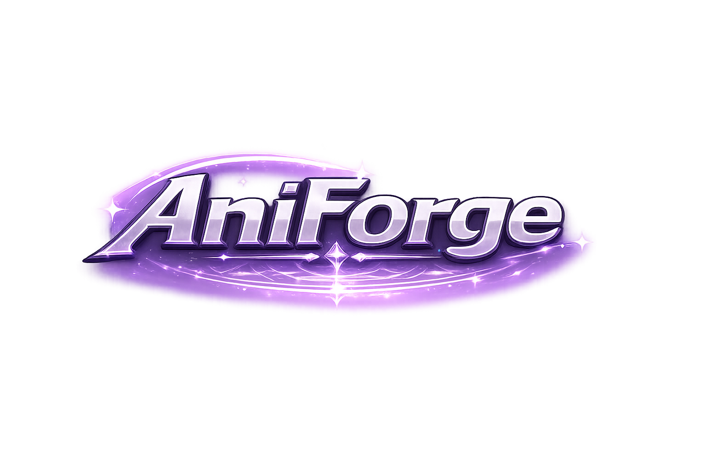

<p align="center">
  
</p>

# AniForge

**Bring Any Character to Life**

Turn a single character standee (立绘) + action text into a Live2D-style pair of clips: a looping **idle** and a one-shot **action** you can click to play.

Example assets below come from a full **Run all** session  
`runs/0d04d189a7d045ebaeb5fa7ae7ee6895` (720×1280, seed 801854411, RMBG-2.0 HQ).  
Frames: idle @ **0.5s**, action @ **0.7s** (puppy-paw pose peak).

---

## Pipeline at a glance

| Step | Stage | What it does | Main products |
|:----:|-------|--------------|---------------|
| 0 | **Input** | Character still | `input.png` |
| 1 | **Extract** | HMR pose from image | `extract_skel.png`, `extract_pose.npy` |
| 2 | **Idle skeleton** | Kimodo + Live2D breath shaping | `idle_skel.mp4`, `idle_guide.mp4`, `idle_seed*.npz` |
| 3 | **Action skeleton** | Kimodo from action prompt ± joint spring | `action_skel.mp4`, `action_guide.mp4`, `action_*seed*.npz` |
| 4 | **SCAIL idle** | Drive image with idle guide (cfg≈3) | `idle.mp4` |
| 5 | **SCAIL action** | Drive image with action guide | `action.mp4` |
| 6 | **BG remove** | RMBG-2.0 HQ default; gray preview + alpha | `*_nobg.mp4`, `*_nobg.webm`, `*_nobg_alpha.mov` |
| 7 | **Time overshoot** | Spring remap on **action** only | `action_timed.mp4`, `action_timed.webm` |
| 8 | **Preview** | UI: idle loops; **click** → action once → idle | Combined player |

### Example action prompt

```text
Quickly raises both hands to chest height in a cute puppy-paw pose,
elbows bent and wrists relaxed downward.
```

Kimodo receives only the body-motion description. Mouth and face stability are
handled later by the SCAIL video prompt.

---

## Step-by-step products (example run)

### 0 · Input

Character image uploaded as the session reference.


→ `input.png`

### 1 · Extract pose

HMR still skeleton for review (root pin by pose mode).


→ `extract_skel.png` · `extract_pose.npy`

### 2 · Idle skeleton

Kimodo idle motion + breath shaping; arms/legs locked.


→ `idle_skel.mp4` · `idle_guide.mp4` · `idle_seed*.npz`

### 3 · Action skeleton

Kimodo action (+ optional joint overshoot). Frame at **0.7s** (puppy-paw peak).

Joint overshoot exposes **frequency** (`omega`, default `20`), **damping**
(`zeta`, default `0.35`), and **softness** (`soft`, default `1.0`). Hover or
focus each `i` icon in the UI for a short explanation.


→ `action_skel.mp4` · `action_guide.mp4` · `action_joint_seed*.npz`

### 4 · SCAIL idle

Reference image driven by idle guide.


→ `idle.mp4`

### 5 · SCAIL action

Same character driven by action guide.


→ `action.mp4`

### 6 · Background remove

Default **RMBG-2.0 HQ**. Browser preview uses neutral gray; CapCut uses ProRes alpha.

| Idle no-bg | Action no-bg |
|:----------:|:------------:|
|  |  |

→ `idle_nobg.mp4` / `.webm` / `_alpha.mov` · `action_nobg.*`

### 7 · Time overshoot

Playback spring on the action (alpha preserved in webm; H.264 preview on gray).

The UI exposes **Overshoot strength** (`b`, `0–0.7`, default `0.42`) and
**Settle duration** (`t`, `0.5–1.8s`, default `1.15s`). Run all uses the same
controls and defaults.


→ `action_timed.mp4` · `action_timed.webm`

### 8 · Preview (UI)

Idle loops by default. **Click the video** to play action once, then return to idle.

---

## Typical `runs/<run_id>/` layout

```text
input.png
extract_skel.png / extract_pose.npy
idle_skel.mp4 / idle_guide.mp4 / idle_seed*.npz
action_skel.mp4 / action_guide.mp4 / action_*seed*.npz
idle.mp4 / action.mp4
idle_nobg.mp4 + .webm + _alpha.mov
action_nobg.mp4 + .webm + _alpha.mov
action_timed.mp4 + .webm
meta.json
```

**CapCut:** import `*_nobg_alpha.mov` (ProRes 4444).  
**Browser:** H.264 with transparency flattened onto gray (same as bgremove preview).

Full-res frames also live under [`docs/readme-assets/`](docs/readme-assets/) (README embeds 280px thumbs).

---

## Quick start

### Prerequisites

1. **ComfyUI-scail** with Kimodo (SOMA) + SCAIL2 (`WanSCAILToVideo`), default URL `http://127.0.0.1:8188`
2. **ffmpeg** on PATH
3. **Python 3.10–3.12**
4. For the default native background-removal backend: a CUDA-capable Python with CUDA builds of **PyTorch** and **torchvision**
5. Optional legacy comparison backend: **videoBGremoval** sibling folder

### Configure paths

```bash
cp .env.example .env
```

| Variable | Purpose |
|----------|---------|
| `COMFYUI_SCAIL_ROOT` | ComfyUI root (`input/`, `output/`, `custom_nodes/`) |
| `ANIFORGE_BGREMOVE_BACKEND` | `native` by default; set `external` only to compare with legacy videoBGremoval |
| `VIDEO_BG_REMOVAL_ROOT` | Optional legacy videoBGremoval repo path |
| `RMBG_MODEL_DIR` | Optional local RMBG-2.0 model directory |
| `COMFY_PYTHON` | Python executable used by native matting subprocesses; point this at the CUDA PyTorch environment |
| `STANDEE_DIR` | Optional standee image folder for batch tools |

If `COMFYUI_SCAIL_ROOT` is unset, AniForge looks for `../ComfyUI-scail`, else `./.comfy/…`. The `../videoBGremoval` sibling path is used only when `ANIFORGE_BGREMOVE_BACKEND=external` and `VIDEO_BG_REMOVAL_ROOT` is unset.

### Install & run

```bash
pip install -r requirements.txt
python server/app.py
```

### Native background removal dependencies

`ANIFORGE_BGREMOVE_BACKEND=native` is the default and runs in `COMFY_PYTHON` when it is set. Install the CUDA-enabled `torch` and `torchvision` builds matching the target GPU and CUDA runtime using the [official PyTorch selector](https://pytorch.org/get-started/locally/); do not install a CPU-only torch build for this backend. Then install the native non-torch dependencies into that same interpreter:

```bash
<path-to-cuda-python> -m pip install -r requirements-bgremove.txt
```

Set `COMFY_PYTHON` in `.env` to `<path-to-cuda-python>`. A ComfyUI Python environment is suitable when it has compatible CUDA PyTorch, `torchvision`, and the packages in `requirements-bgremove.txt` installed. The native backend also downloads RMBG-2.0 from Hugging Face unless `RMBG_MODEL_DIR` points to a local model directory.

Open **http://127.0.0.1:8500**

| Tab | Use |
|-----|-----|
| **Run all** | Image + action prompt → full pipeline + shared click preview |
| **Step by step** | Extract → idle → action → SCAIL (editable prompts) → bg → time |

Windows: `start.bat` / `stop.bat` (port 8500).

---

## Models

```text
Image ──HMR──► extract
  idle text ──Kimodo──► idle skel ──SCAIL2──► idle.mp4 ──RMBG──► idle_nobg*
  action text ──Kimodo──► action skel (±joint) ──SCAIL2──► action.mp4 ──RMBG──► action_nobg*
                                                              └──time──► action_timed*
```

| Stage | Engine |
|-------|--------|
| Extract | HMR / seated extract |
| Motion | Kimodo (SOMA), idle ~2s breath |
| Drive | SCAIL-2 + LightX2V distill; default **cfg=3** |
| Matte | **RMBG-2.0 HQ** (RVM optional) |
| Time | Spring remap on action |

SCAIL text describes the **finished video**. Defaults: `/api/scail-defaults`.

---

## Status

MVP end-to-end. Click preview: loop idle / play action / return. Heavy soft-body secondary motion is out of scope for the skeleton path.
