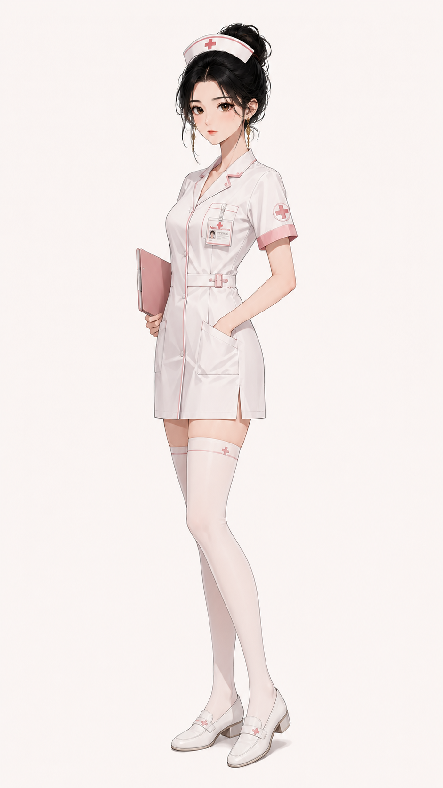
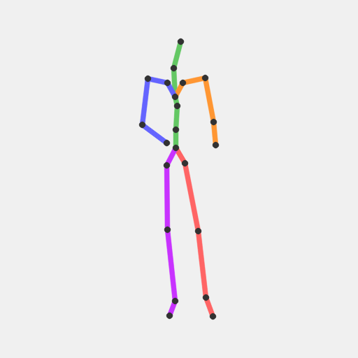
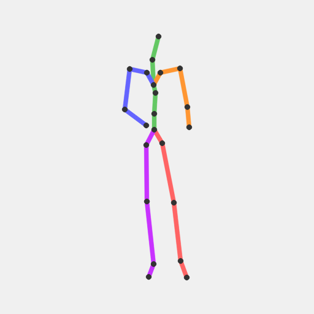
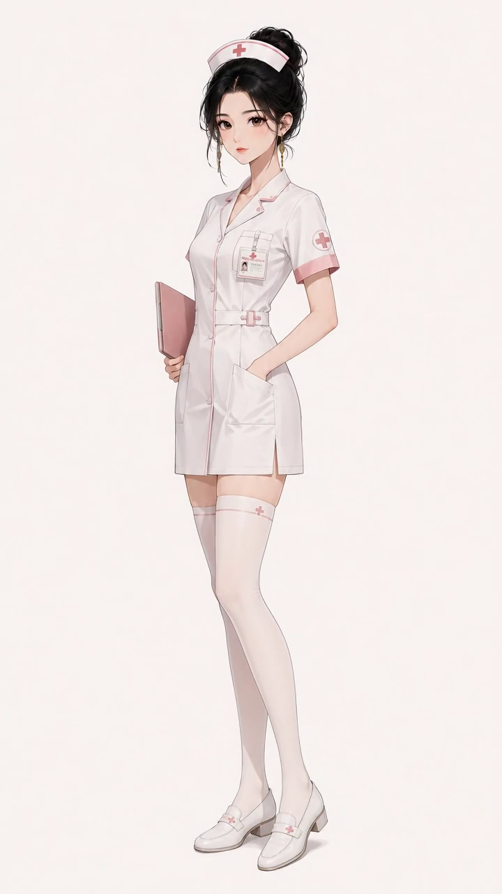
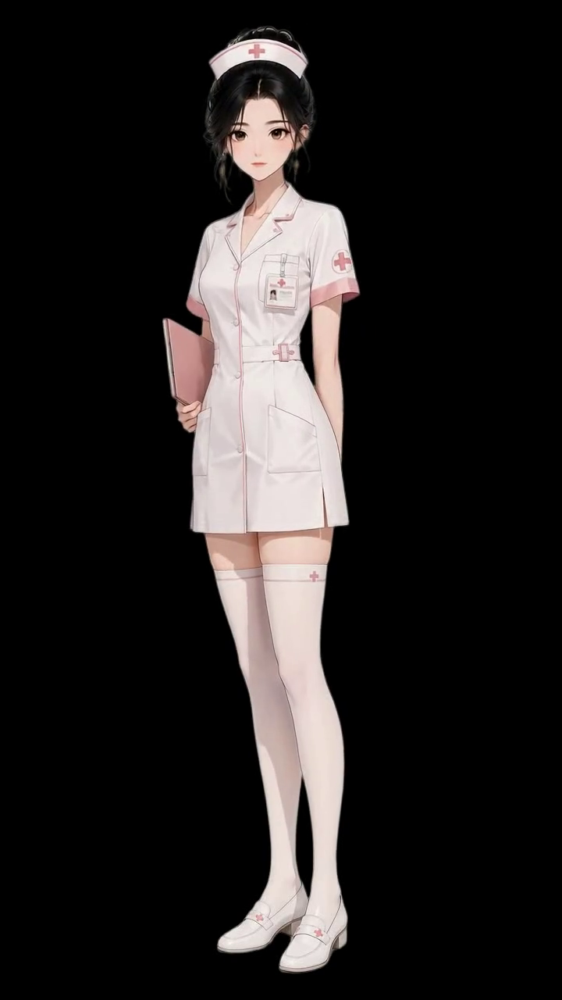

# AniForge

**Bring Any Character to Life**

Turn a single character standee (立绘) + action text into a Live2D-style pair of clips: a looping **idle** and a one-shot **action** you can click to play.

Example below is a full **Run all** pipeline from session  
`runs/b814053601c843cb998d5997c30df8f0` (nurse, 720×1280, seed 42, RMBG-2.0 HQ).

---

## Example run (step → product)

| Step | What it does | Main product | Preview |
|:----:|--------------|--------------|---------|
| **0 · Input** | Character image (session `input.png`) | `input.png` |  |
| **1 · Extract** | HMR pose from the image; still skeleton for review | `extract_skel.png` / `extract_pose.npy` |  |
| **2 · Idle skeleton** | Kimodo text→motion + Live2D-style breath shaping; arms/legs locked | `idle_skel.mp4`, `idle_guide.mp4`, `idle_seed*.npz` |  |
| **3 · Action skeleton** | Kimodo from **action prompt**; optional **joint overshoot** spring | `action_skel.mp4`, `action_guide.mp4`, `action_joint_seed*.npz` |  |
| **4 · SCAIL idle** | Drive reference image with idle guide (cfg≈3, pos/neg prompts) | `idle.mp4` |  |
| **5 · SCAIL action** | Drive reference image with action guide | `action.mp4` |  |
| **6 · BG remove** | Default **RMBG-2.0 HQ**; gray preview + VP9 alpha + ProRes for CapCut | `idle_nobg.mp4` / `*_nobg.webm` / `*_nobg_alpha.mov` |  |
| | | `action_nobg.*` |  |
| **7 · Time overshoot** | Spring remaps **action** timing (prefers alpha webm); browser mp4 on gray | `action_timed.mp4`, `action_timed.webm` |  |
| **8 · Preview** | UI: idle loops; **click** → play action once → back to idle | Combined player | — |

### This example’s action prompt

```text
Slowly bring both hands to the waist and rest them firmly on the hips in a
relaxed hands-on-hips pose, then hold still. Smooth, gentle, soft motion,
not snappy. Both arms move together; clipboard can settle at the hip if
needed. Torso upright, hips and feet fixed, no stepping, no twist.
Mouth closed and still, lips sealed, silent, no talking.
```

### Typical `runs/<run_id>/` layout

```text
input.png                 # 0  character still
extract_skel.png          # 1  pose still
extract_pose.npy
idle_skel.mp4 / idle_guide.mp4 / idle_seed*.npz   # 2
action_skel.mp4 / action_guide.mp4 / action_*seed*.npz  # 3 (+ joint)
idle.mp4 / action.mp4     # 4–5 SCAIL character videos
idle_nobg.mp4 + .webm + _alpha.mov
action_nobg.mp4 + .webm + _alpha.mov              # 6
action_timed.mp4 + .webm  # 7
meta.json                 # prompts, flags, sizes
```

**CapCut:** import `*_nobg_alpha.mov` (ProRes 4444, real alpha).  
**Browser preview:** H.264 with transparency flattened onto neutral gray (same as bgremove preview).

---

## Quick start

### Prerequisites

1. **ComfyUI-scail** (or equivalent) with Kimodo (SOMA) + SCAIL2 (`WanSCAILToVideo`), default URL `http://127.0.0.1:8188`
2. **ffmpeg** on PATH (or videoBGremoval portable ffmpeg)
3. **Python 3.10–3.12** (`cgi` required by the server)
4. Optional: **videoBGremoval** as a sibling folder (or set `VIDEO_BG_REMOVAL_ROOT`)

### Configure paths (required for a public clone)

No machine-specific paths are hard-coded. Copy and edit:

```bash
cp .env.example .env   # or set the same vars in your shell
```

| Variable | Purpose |
|----------|---------|
| `COMFYUI_SCAIL_ROOT` | ComfyUI install root (`input/`, `output/`, `custom_nodes/`) |
| `VIDEO_BG_REMOVAL_ROOT` | videoBGremoval repo root |
| `COMFY_PYTHON` | Optional Python with torch for Kimodo/matting subprocesses |
| `STANDEE_DIR` | Optional folder of standee images for batch tools |

If `COMFYUI_SCAIL_ROOT` is unset, AniForge looks for a sibling folder `../ComfyUI-scail`, else uses `./.comfy/input|output` for staging.

### Install & run UI

```bash
cd AniForge
pip install -r requirements.txt
python server/app.py
```

Open **http://127.0.0.1:8500** (local default)

| Tab | Use |
|-----|-----|
| **Run all** | Image + **action prompt** → full pipeline; shared click **Preview** at bottom |
| **Step by step** | Extract → idle → action → SCAIL (editable pos/neg) → bg remove → time |

Windows helpers: `start.bat` / `stop.bat` (port 8500).

### CLI / batch

```bash
python run.py …                    # standalone generate
python tools/run_character_full.py --preset nurse
python tools/rerun_scail_existing.py --run-id <id>
```

---

## Pipeline (models)

```text
Image ──HMR──► extract pose
                │
  idle prompt ──Kimodo──► idle skeleton ──SCAIL2──► idle.mp4 ──RMBG──► idle_nobg*
  action text ──Kimodo──► action skeleton (±joint spring)
                            └──SCAIL2──► action.mp4 ──RMBG──► action_nobg*
                                                      └──time spring──► action_timed*
```

| Stage | Engine / notes |
|-------|----------------|
| Extract | HMR / seated extract, root pin by pose mode |
| Motion | Kimodo (SOMA), idle ~2s breath loop |
| Drive | SCAIL-2 Wan + LightX2V distill; default **cfg=3** so negatives work |
| Matte | **RMBG-2.0 HQ** default (also RVM options) |
| Time | Joint-space spring remap on action only |

SCAIL prompts describe the **finished video** (not edit instructions). Defaults load from `/api/scail-defaults`; UI can edit idle/action positive + negative.

---

## Status

MVP end-to-end. Click preview is loop idle / play action / return. Secondary soft-body (heavy hair/skirt bounce) is out of scope for the skeleton path.

Example assets live under [`docs/readme-assets/`](docs/readme-assets/) (frames from run `b8140536…`).
