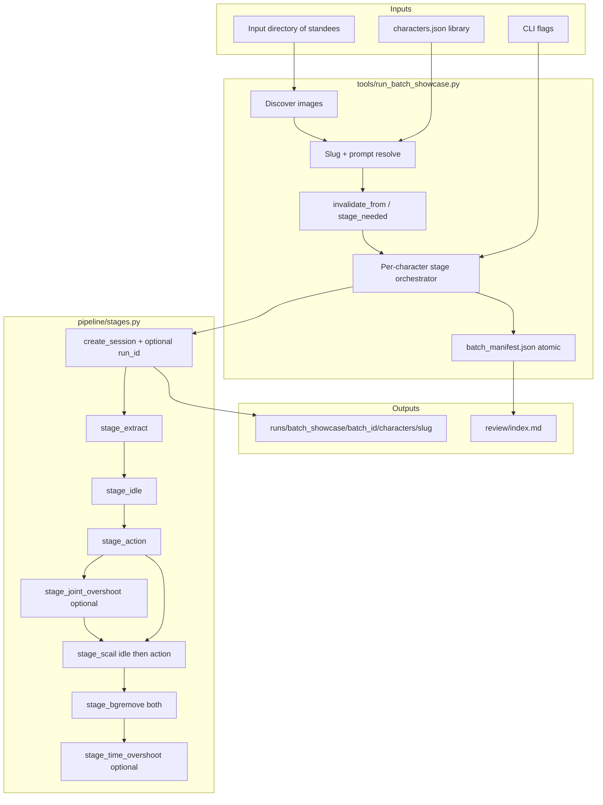
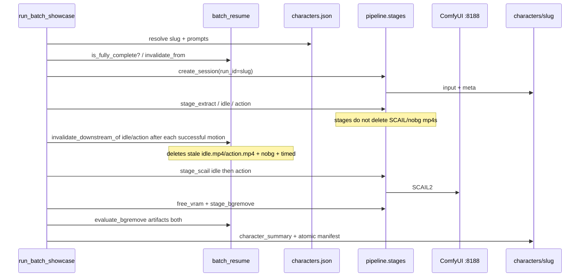

# Batch Character Showcase Pipeline — Design

| Field | Value |
|-------|--------|
| **Title** | Batch Character Showcase Pipeline for Motion Portrait |
| **Author** | (TBD) |
| **Date** | 2026-07-09 |
| **Status** | Draft (revised after design review) |
| **Repo** | `$ANIFORGE_ROOT` |
| **Related** | `docs/superpowers/specs/2026-07-07-motion-portrait-design.md`, `tools/run_demo_pipeline.py`, `pipeline/stages.py` |

---

## Overview

Motion Portrait already supports a **single-image, staged product pipeline** (session → extract → idle → action → SCAIL → bg remove → optional time overshoot → preview). Operators now need to run that same path across a **folder of character standees (立绘)** with **per-character action prompts**, organized outputs, resume/skip, and VRAM hygiene between heavy ComfyUI stages.

This design specifies a **CLI batch orchestrator** plus a **data-driven character action library (JSON, stdlib-only)** that reuses existing stage functions in `pipeline/stages.py` without changing the web UI or server API for v1. The first concrete job is five PNGs under:

`$STANDEE_DIR`

| Filename | Proposed slug |
|----------|----------------|
| `cyber runner.png` | `cyber_runner` |
| `mage.png` | `mage` |
| `maid.png` | `maid` |
| `mecha polit.png` | `mecha_pilot` (filename typo preserved as source; slug corrected) |
| `nurse.png` | `nurse` |

---

## Background & Motivation

### Current state

- **Web product** (`web/index.html` + `web/app.js` + `server/app.py`): stepwise UI with “Run all”:

  1. Create session  
  2. Extract pose  
  3. Idle skeleton  
  4. Action skeleton (optional joint overshoot)  
  5. SCAIL idle + SCAIL action  
  6. **Background remove**  
  7. Optional **time overshoot** (prefers `action_nobg.mp4`)  
  8. Preview  

- **Demo CLI** (`tools/run_demo_pipeline.py`): one hardcoded image + one generic wave action; seed 42; scale 0.5; standing; SCAIL then bgremove both; **no** time overshoot; no multi-character loop; no resume. Successful reference run: `runs/40095bea9ff74420847875dc794c9526/` (`meta.json`: seed 42, scale 0.5, size 352×640, step `bgremove`).
- **Runs layout**: `runs/<uuid-hex>/` with `meta.json`, `input.*`, skeletons, `idle.mp4` / `action.mp4`, `*_nobg.*`, etc. Server always uses flat `RUNS_DIR = runs/`.
- **Live2D idle defaults** already land in `pipeline/generate.py` (`DEFAULT_IDLE_PROMPT`, `shape_live2d_idle`, ~2s, micro head/chest, arms locked). Idle duration is fixed at `IDLE_DURATION_SEC = 2.0` and is **not** library-configurable in v1.
- **Stage invalidation reality** (important for resume): `stage_action` clears `action_scail_done`, `scail_done`, `time_overshoot`, `joint_overshoot`, and deletes `action_joint_seed{seed}.npz`. It does **not** clear `bgremove_done` / per-label bg flags, nor delete `action.mp4` / `*_nobg.*` / `action_timed.mp4` (same pattern for idle vs `idle.mp4`). `stage_bgremove` sets aggregate `bgremove_done=True` if **any** nobg output exists. Because SCAIL done checks are artifact-first, the **batch runner** must call `invalidate_downstream_of` after **every** successful idle/action motion re-run (force **or** natural), not only when `--force-stages` is set (see Resume algorithm).

### Pain points

1. **Manual one-by-one** through UI is slow for multi-standee showcases.  
2. **Generic wave** does not sell character archetypes.  
3. **UUID-only run dirs** make review (“which folder is the mage?”) painful.  
4. **SCAIL + Kimodo** share ComfyUI `:8188` with limited VRAM; batch must free between characters and heavy stages.  
5. Long SCAIL runs fail mid-batch; need **resume / skip completed** and **fail-one-continue** without shipping **stale nobg/SCAIL** videos.

### Why not “just loop the UI API”?

HTTP multipart + browser timeouts are a poor fit for multi-hour SCAIL batches. Calling `create_session` / `stage_*` **in-process** (same as `run_demo_pipeline.py`) is the proven path.

---

## Goals & Non-Goals

### Goals

1. Discover character images (default: PNG/JPG/WebP) from a configurable input directory.  
2. Map each file to a **stable slug** and an **archetype action prompt** (and optional idle flavor) via a **JSON character library** (stdlib `json`; optional local override).  
3. Run the **current product stage order**, including **bg remove before time overshoot**.  
4. Organize outputs for review: stable slug folders + index/manifest.  
5. Support **resume/skip completed**, **fail-one-continue**, **VRAM free** between jobs and before SCAIL/bgremove — with **artifact-based** completion and an explicit **force/invalidation matrix**.  
6. Keep character content **data-driven**, not buried only in Python string literals.  
7. Provide **concrete English Kimodo prompts** for the five known standees (upper-body friendly ~2s gestures, mouth closed, hips/feet stable).  
8. English-only product/code/data strings (project rule).

### Non-Goals (v1)

- Web UI for batch jobs or multi-character gallery (web session list unchanged; batch is CLI-only discoverability).  
- Parallel SCAIL jobs on one GPU (VRAM cannot support concurrent drives).  
- Multi-action library per character (one showcase action only).  
- Seamless idle↔action anchor closure beyond existing extract-anchored alignment.  
- Auto-uploading assets into youtube-video-lab or Live2D runtime packaging.  
- Renaming source files on disk (slug correction is output-side only).  
- Changing SCAIL quality defaults for “final ship” (batch defaults mirror demo: `scale=0.5`; full scale is a flag).  
- Configurable idle duration (product fixed at 2.0s).  
- Implementing this design in this document pass (design only).

---

## Proposed Design

### High-level architecture



### Component layout (new files)

| Path | Role |
|------|------|
| `tools/run_batch_showcase.py` | CLI: discover → resolve → invalidate/force → stages → manifest |
| `pipeline/batch_resume.py` (or `tools/batch_resume.py`) | `expand_force`, `invalidate_from`, `invalidate_downstream_of`, `stage_needed`, `is_fully_complete`, `evaluate_bgremove`, `finalize_character_status` — **unit-tested without GPU** |
| `tools/character_library.py` | Load/merge JSON, slugify, match image → entry, `assert_safe_run_id` shared with session |
| `config/characters.json` | Data-driven archetypes + default prompts (committed) |
| `config/characters.local.json` (optional, **gitignored**) | Local overrides |
| `runs/batch_showcase/<batch_id>/` | Batch root: manifest, log, per-slug run dirs (under existing `runs/` gitignore) |
| `tests/test_character_library.py` | Slugify, matching, five basenames → ids (fixtures only) |
| `tests/test_batch_resume.py` | Invalidation matrix, completion gates, force parsing (tmpdir, no GPU) |
| `tests/test_stages_session.py` | `create_session(run_id=, overwrite=)` contract (no HTTP) |

No changes required to `server/app.py` or `web/` for v1.

---

### Stage order (per character) — must match product

Align with “Run all” in `web/app.js` and demo pipeline:

| Step | Product name | Function | Notes |
|------|----------------|----------|--------|
| 0a | Batch preflight | `ComfyClient.object_info` + `free_vram` | Once at batch start if any character may SCAIL |
| 0b | Character start | optional free only if prior char ran GPU work | Do **not** free on pure `skipped_complete` |
| 1 | Create session | `create_session(..., run_id=slug, runs_dir=...)` | Standing default; seed/scale from library+CLI |
| 2 | Extract | `stage_extract` | Hard fail character if errors |
| 3 | Idle | `stage_idle(..., idle_prompt=None\|str)` | Live2D-shaped; `None` → `DEFAULT_IDLE_PROMPT`; duration fixed 2.0s |
| 4 | Action | `stage_action` | Archetype prompt required |
| 4b | Joint overshoot | `stage_joint_overshoot` | **Before** SCAIL; default **off**; flag wired in v1 core CLI |
| 5a | SCAIL idle | `stage_scail(which="idle")` | Stage frees VRAM min 8GB |
| 5b | SCAIL action | `stage_scail(which="action")` | Separate calls like Run all / demo |
| 6 | BG remove | `stage_bgremove(which="both")` | **Before** time overshoot |
| 7 | Time overshoot | `stage_time_overshoot` | Prefers `action_nobg.mp4`; default **off**; flag wired in v1 |
| 8 | Summaries | `character_summary.json` + manifest | Written by batch runner |

**Default showcase flags** (v1 CLI defaults):

| Flag | Default | Rationale |
|------|---------|-----------|
| `--pose-mode` | `standing` | Standees are standing 立绘 |
| `--scale` | `0.5` | Demo-proven SCAIL speed/VRAM |
| `--seed` | `42` (library/CLI override) | Reproducible comparison |
| `--idle-motion-keep` | `0.08` | Product Live2D default |
| `--action-motion-keep` | `1.0` | Full gesture |
| `--action-duration` | `2.0` | Upper-body friendly short clip |
| `--bgremove` / `--no-bgremove` | on | Showcase needs nobg assets |
| `--time-overshoot` | off | Optional polish after content lock |
| `--joint-overshoot` | off | Opt-in; slot always present in orchestrator |
| `--continue-on-error` | on | Fail-one-continue |
| `--skip-completed` | on | Resume |
| `--batch-id` | auto `YYYYMMDD_HHMMSS` local time if omitted | Explicit id recommended for named packs |
| `--runs-root` | `<repo>/runs` | Override for tests / alternate disks |
| `--force-stages` | empty | Comma list; see Resume algorithm |
| `--force-recreate` | off | Wipe slug dir and recreate session |

---

### Output organization

```
runs/batch_showcase/
  <batch_id>/
    batch_config.json
    batch_manifest.json          # atomic write (temp + replace)
    batch_manifest.json.lock     # optional simple lock file (PID)
    batch.log
    characters/
      cyber_runner/              # run_id == slug
        meta.json
        input.png
        ... stage artifacts ...
        character_summary.json
      mage/
      ...
    review/
      index.md
```

**CLI-only discoverability:** operators look under `runs/batch_showcase/`, not top-level `runs/<uuid>/`. The web session list is unchanged and will not enumerate batch slugs.

**Serving / preview:** stages’ `_rel_url` yields paths like `/runs/batch_showcase/<batch_id>/characters/<slug>/idle_nobg.mp4`. If `server/app.py` is running, static `/runs/` serving can open those URLs. Operators may also open files via Explorer / `file://`. No gallery UI in v1.

**`--runs-root`:** batch root = `<runs-root>/batch_showcase/<batch_id>/`. Must resolve under an allowed root (default repo `runs/`); see Security.

**Concurrent batches:** same `--batch-id` from two processes is unsupported. Write `batch_manifest.json.lock` with PID at start; refuse if lock held by live PID (optional; document as operator responsibility if lock skipped). Manifest writes use write-temp-then-rename.

**How `runs_dir` works:** pass `runs_dir=<batch_root>/characters` into stages. Today `create_session` always assigns UUID; v1 extends it with optional `run_id`.

#### Recommended: `create_session(run_id=...)` (K4)

See **API / create_session contract** below for full resume rules.

#### Alternative E (pointer-only, no `run_id` change) — viable MVP

If PR2 is deferred:

1. `create_session` → UUID under `runs_dir` (or default `runs/`).  
2. Write `characters/<slug>/POINTER.json` → `{ "run_id", "run_dir", "seed", "scale" }` — **no symlinks** (Windows-friendly).  
3. Manifest maps slug → run_dir for review.

Trade-off: review requires following pointers; still works. Keep `run_id=slug` as recommended path; pointer-only is acceptable fallback without blocking showcase.

---

### Image discovery

```python
IMAGE_EXTS = {".png", ".jpg", ".jpeg", ".webp"}

def discover_images(input_dir: Path) -> list[Path]:
    return sorted(
        p for p in input_dir.iterdir()
        if p.is_file() and p.suffix.lower() in IMAGE_EXTS and not p.name.startswith(".")
    )
```

- Non-recursive by default.  
- `--only cyber_runner,mage` filters by **resolved library id**.  
- `--require-library-entry` default **true**: unmatched images fail that entry (or skip with warning if continue-on-error and policy = skip_unknown).

---

### Slugify rules

```text
"cyber runner.png"  → cyber_runner
"mecha polit.png"   → mecha_polit   # raw from filename
library match via aliases/source_files → id mecha_pilot
```

Algorithm:

1. stem without extension  
2. NFKC; whitespace/hyphen → `_`  
3. lowercase; keep `[a-z0-9_]` only  
4. collapse `_`  
5. Library lookup: `source_files` (case-insensitive basename) → `id` / `aliases` → raw slug  

Library **id** is the stable `run_id` / folder name. Shared validator: `assert_safe_run_id(s)` → must match `^[a-z0-9_]+$` (non-empty, no path separators).

---

### Character library (data-driven, JSON)

**K13 — Format:** committed **`config/characters.json`** loaded with stdlib `json`. **No PyYAML** dependency (`requirements.txt` currently has numpy, opencv-python, Pillow, matplotlib only). Optional `config/characters.local.json` deep-merges per character id; gitignore `config/characters.local.json`.

**Why not YAML:** multi-line prompts work fine as JSON strings; zero new deps; matches rest of repo (meta/manifest already JSON). YAML may be added later only with an explicit `PyYAML` pin — not v1.

```json
{
  "version": 1,
  "defaults": {
    "pose_mode": "standing",
    "scale": 0.5,
    "seed": 42,
    "idle_motion_keep": 0.08,
    "action_motion_keep": 1.0,
    "action_duration": 2.0,
    "idle_prompt": null,
    "bgremove": true,
    "bgremove_model": "RVM MobileNetV3",
    "joint_overshoot": false,
    "time_overshoot": false
  },
  "characters": {
    "cyber_runner": {
      "display_name": "Cyber Runner",
      "aliases": ["cyber runner", "cyber_runner"],
      "source_files": ["cyber runner.png"],
      "archetype": "agile neon street runner",
      "action_prompt": "Raise both hands briefly near chest height in a quick ready stance, elbows close to the torso. Then point the right hand to the side of frame at shoulder height with a sharp, compact motion (no lunging, no reaching toward camera). Small determined head tilt. Hips and feet fixed. Mouth closed and still.",
      "idle_prompt": null,
      "notes": "Gesture is upper-body; standing full-body SCAIL positives still apply to the full standee image."
    },
    "mage": {
      "display_name": "Mage",
      "aliases": ["mage"],
      "source_files": ["mage.png"],
      "archetype": "composed spellcaster",
      "action_prompt": "Lift the right hand to chest height with palm open as if holding a small sphere, hold one beat, then close the fingers gently and lower the hand a little. Soft presence; minimal shoulder movement; body facing forward. Hips and feet fixed. Mouth closed and still.",
      "idle_prompt": null
    },
    "maid": {
      "display_name": "Maid",
      "aliases": ["maid"],
      "source_files": ["maid.png"],
      "archetype": "polite service character",
      "action_prompt": "Give a small head bow only; shoulders dip slightly; hips and feet stay fixed with no waist bend. Hands lightly together in front of the lower chest, then return upright with a small courteous nod. Graceful and compact; no large arm swings. Mouth closed and still.",
      "idle_prompt": null
    },
    "mecha_pilot": {
      "display_name": "Mecha Pilot",
      "aliases": ["mecha polit", "mecha_polit", "mecha pilot", "mecha_pilot"],
      "source_files": ["mecha polit.png"],
      "archetype": "cockpit pilot / tactical operator",
      "action_prompt": "Bring the right hand up beside the temple in a crisp salute, hold briefly, then lower the hand to a firm ready position near the chest. Confident military bearing; torso forward; no body turn. Hips and feet fixed. Mouth closed and still.",
      "idle_prompt": null
    },
    "nurse": {
      "display_name": "Nurse",
      "aliases": ["nurse"],
      "source_files": ["nurse.png"],
      "archetype": "calm caring medic",
      "action_prompt": "Raise the right hand to shoulder height in a gentle open-palm wave of reassurance, then rest the hand lightly over the heart area for a calm caring beat. Soft, measured motion; no frantic gestures. Hips and feet fixed. Mouth closed and still.",
      "idle_prompt": null
    }
  }
}
```

**Resolution order:** (1) `source_files` basename match (2) id/aliases (3) optional generic action (4) else error.

**`idle_prompt: null`:** pass `idle_prompt=None` into `stage_idle` (omit empty string). Verified: empty/None → `DEFAULT_IDLE_PROMPT` + `shape_live2d_idle`. **Idle duration not configurable in v1.**

**Prompt QA checklist** (before freezing library content):

1. English only; ends with mouth closed / still (or rely on `sanitize_action` / `ensure_mouth_still`).  
2. No turn/talk/walk/run/dance verbs.  
3. One clear phrase for ~2s (raise → hold → settle).  
4. Standing: prefer “hips and feet fixed”; avoid deep waist bows and Z-reach “toward camera.”  
5. Motion language only (no VFX/glow dependency).  
6. After `sanitize_action`, re-read for accidental empties.  
7. SCAIL positives say “full body” — means identity-consistent full standee drive, **not** that gestures must animate legs.

**Post-sanitize note:** `sanitize_action` strips `\bturn(ing|s)?\b` and speech verbs, then appends mouth-still if missing. Sample library prompts already avoid turn/talk; mouth clause is present.

---

### Resume algorithm (implementation-ready)

**Ownership:** `pipeline/batch_resume.py` (or `tools/batch_resume.py`) + tests in **PR3** (`tests/test_batch_resume.py`). PR1 library does **not** own resume.

#### Artifact helper

```python
def artifact_ok(path: Path, min_bytes: int = 1) -> bool:
    return path.is_file() and path.stat().st_size >= min_bytes
```

#### Precedence: file vs meta

| Rule | Behavior |
|------|----------|
| **Done check** | Require **artifact_ok** for required files; meta flags are hints only |
| **Crash mid-scail** | `stage_scail` writes meta once at end. If `idle.mp4` exists with size>0 but `idle_scail_done` false → treat idle SCAIL as **done** (do not re-run); if file missing/zero → **needed** |
| **Stale meta** | If meta says done but artifact missing → **needed** (re-run) |
| **Manifest `running`** | On batch start, any character with `status=running` from a killed process → treat as incomplete; clear to resume stages (do not skip) |

#### Stage done predicates (when not forced)

| Stage | Done when (all must hold) |
|-------|---------------------------|
| extract | `constraint.json` ok (prefer also `meta.extracted`) |
| idle | `idle_seed{seed}.npz` + `idle_guide.mp4` ok |
| action | `action_seed{seed}.npz` + `action_guide.mp4` ok |
| joint (if flag) | `meta.joint_overshoot` and `action_joint_seed{seed}.npz` ok |
| scail_idle | `idle.mp4` ok |
| scail_action | `action.mp4` ok |
| bgremove (if flag) | **both** `(idle_nobg.mp4 or idle_nobg.webm)` and `(action_nobg.mp4 or action_nobg.webm)` ok — **ignore** aggregate `meta.bgremove_done` |
| time (if flag) | `action_timed.mp4` ok **or** (`meta.time_overshoot` and `action.mp4` ok after remap) |

#### `is_fully_complete(run_dir, flags) -> bool`

Requires every enabled stage’s done predicate.  
If `flags.bgremove`: **both** idle and action nobg required.  
Partial bg → **False** → `--skip-completed` will **not** skip.  
Returns False if no `meta.json`.

#### Character status enum (manifest + result)

| Status | Meaning |
|--------|---------|
| `pending` | Not started |
| `running` | In progress (crash → resume as incomplete) |
| `ok` | All enabled stages fully complete (both nobg if bg on) |
| `ok_partial_bgremove` | Pipeline through SCAIL ok; bgremove produced only one of idle/action nobg |
| `failed` | Hard stage failed |
| `skipped_complete` | `is_fully_complete` and skip-completed |
| `skipped_no_library` | Optional policy |

**K14 — Partial bg policy:**  
- During run: record per-clip `idle_bgremove` / `action_bgremove` in manifest.  
- Character terminal status: `ok` only if both nobg present when bgremove enabled; else `ok_partial_bgremove` if ≥1 nobg and SCAIL ok; else `failed` if zero nobg when bgremove enabled.  
- Batch exit code 1 if any `failed` or `ok_partial_bgremove` (strict) **or** only if any `failed` with warn on partial — **v1 default: exit 1 on `failed` only; warn and count partial in summary** so overnight multi-hour runs are not “all failed” for one missing webm. Partial never counts as skip-complete.

#### Invalidation API (single surface — no parallel names)

Matrix keys only (also the only legal `--force-stages` tokens after alias expansion):

`extract` | `idle` | `action` | `joint` | `scail` | `scail_idle` | `scail_action` | `bgremove` | `time`

```python
# CLI / force membership expansion (exact table — no other aliases)
FORCE_ALIASES: dict[str, list[str]] = {
    "scail": ["scail_idle", "scail_action"],
    # all other keys map to themselves only
}

def expand_force(force_cli: set[str]) -> set[str]:
    """Expand aliases then validate. Unknown token → exit 3 before any work."""
    out: set[str] = set()
    allowed = {
        "extract", "idle", "action", "joint", "scail",
        "scail_idle", "scail_action", "bgremove", "time",
    }
    for tok in force_cli:
        if tok not in allowed:
            raise SystemExit(3)  # or collect and fail batch
        if tok in FORCE_ALIASES:
            out.update(FORCE_ALIASES[tok])
        else:
            out.add(tok)
    return out

def invalidate_from(run_dir: Path, stage: str, *, keep_motion: bool = False) -> None:
    """Apply matrix row for `stage` (matrix keys only).

    keep_motion=False (default, used for --force-stages at character start):
      delete motion artifacts for that stage as well (e.g. action_seed*, guides).
    keep_motion=True (used after a successful motion re-run):
      do **not** delete the motion outputs just produced (npz/skel/guide for
      idle or action). Still delete **all downstream** character videos and
      derived products so artifact-first stage_needed will re-run SCAIL/bg/time.
    """
    ...

def invalidate_downstream_of(run_dir: Path, motion: Literal["idle", "action"]) -> None:
    """Mandatory after every successful stage_idle / stage_action (force or natural).

    Equivalent to invalidate_from(run_dir, motion, keep_motion=True) using the
    idle/action matrix rows' **downstream** columns only.

    idle  → delete/clear: idle.mp4, idle_nobg.*, idle_scail_done, scail_done
            (recompute), idle_bgremove_done, bgremove_done; do not touch action.*
    action → delete/clear: action_joint*, action.mp4, action_nobg.*, action_timed*,
            action_scail.mp4 backup, action_scail_done, joint_overshoot, scail_done,
            action_bgremove_done, bgremove_done, time_overshoot; **full bg pair**
            files (both idle_nobg and action_nobg) in v1 for simplicity so bg
            re-runs both after any action motion change; do not delete
            action_seed*/action_skel/action_guide just written.
    """
    invalidate_from(run_dir, motion, keep_motion=True)
```

**There are no other cascade helpers.** Do not invent `post_action`, `action_downstream_bg_only`, or `invalidate_artifacts_for`.

#### Critical rule: natural re-run must cascade SCAIL (K16)

`stage_idle` / `stage_action` set `*_scail_done = False` but **do not delete** `idle.mp4` / `action.mp4` / nobg / timed.  
SCAIL done checks are **artifact-first**. Therefore:

> **Whenever idle or action motion is successfully re-executed** (whether because `--force-stages` or because natural `stage_needed` saw missing motion artifacts), the orchestrator **must** call `invalidate_downstream_of(run_dir, "idle"|"action")` **immediately after** that successful stage — **before** evaluating `stage_needed` for SCAIL / bg / time.

Without this, old `action.mp4` remains → `stage_needed("scail_action")` is false → silent **stale character video** with new skeleton. Same for idle.

Unit tests in `test_batch_resume.py` must cover:

1. Fixture with complete action SCAIL + delete only action_seed/guide → natural re-run action → assert `action.mp4` gone (or size 0 removed) after cascade → `stage_needed(scail_action)` true.  
2. Same for idle / `idle.mp4`.  
3. Force path still uses `invalidate_from(..., keep_motion=False)` at start (deletes motion too).

#### Invalidation matrix (**batch runner**, not stages alone)

`stage_action` / `stage_idle` alone are **insufficient** for SCAIL or bg invalidation.

| Stage key | Clear meta flags | Delete artifacts (`keep_motion=False`) | Also deleted when `keep_motion=True` (downstream only) |
|-----------|------------------|----------------------------------------|--------------------------------------------------------|
| `extract` | all downstream | constraint, extract_*, all motion/SCAIL/nobg/timed | n/a (force only) |
| `idle` | idle_done, idle_scail_done, scail_done, idle_bg*, bgremove_done | idle_seed*, idle_skel/guide, idle.mp4, idle_nobg.* | idle.mp4, idle_nobg.* (+ flags); **keep** idle_seed/skel/guide |
| `action` | action_done, joint_*, action_scail_done, scail_done, action_bg*, bgremove_done, time_* | action_seed*, joint npz, action_skel/guide, action.mp4, **both** nobg, timed, action_scail.mp4 | action.mp4, joint npz, **both** nobg, timed, action_scail.mp4 (+ flags); **keep** action_seed/skel/guide |
| `joint` | joint, action_scail, scail, action_bg*, bg*, time* | action_joint*, action.mp4, action_nobg.*, timed | (force only; after joint success also call invalidate_downstream style for action SCAIL chain) |
| `scail` | both scail flags, bg*, time* | idle.mp4, action.mp4, all nobg, timed | n/a |
| `scail_idle` | idle_scail_done, scail_done, idle_bg*, bgremove_done | idle.mp4, idle_nobg.* | n/a |
| `scail_action` | action_scail_done, scail_done, action_bg*, bg*, time* | action.mp4, action_nobg.*, timed | n/a |
| `bgremove` | *bgremove* | *_nobg.*; clear time if time flag on | n/a |
| `time` | time_overshoot | action_timed.mp4 | n/a |

**Force at character start:** for each expanded force token, `invalidate_from(run_dir, tok, keep_motion=False)`.  
Example: `--force-stages action` → expand `{action}` → delete action motion + action SCAIL + both nobg + timed; idle SCAIL may remain.  
`--force-stages scail` → expand to `{scail_idle, scail_action}` → invalidate both SCAIL rows (or one combined `scail` row once).

**After joint success** (if joint ran): call the same downstream cleanup as action SCAIL chain (delete action.mp4, both nobg, timed, clear action_scail/bg/time flags) without deleting action_seed — e.g. `invalidate_from(run_dir, "scail_action", keep_motion=False)` plus bg pair files, or a shared helper used only from joint/action paths. Prefer reusing matrix rows: after joint, `invalidate_from(run_dir, "scail_action")` then ensure both nobg deleted (v1: also `invalidate_from(run_dir, "bgremove")`).

#### `--force-stages` CLI

- Parse: comma-separated, strip, lower → set → `expand_force`.  
- Allowed tokens: keys of matrix including `scail` (alias).  
- Unknown → exit 3.  
- On character start: for each name in expanded force, `invalidate_from(..., keep_motion=False)`.  
- Force disables skip-completed for that character.  
- `stage_needed` uses **expanded** force set only (no separate `force_aliases()` call site beyond `expand_force`).

```python
STAGE_ORDER = [
    "extract", "idle", "action", "joint",
    "scail_idle", "scail_action", "bgremove", "time",
]

def stage_needed(run_dir, name, flags, force: set[str]) -> bool:
    """`force` must already be expand_force(...)."""
    if name == "joint" and not flags.joint_overshoot:
        return False
    if name == "bgremove" and not flags.bgremove:
        return False
    if name == "time" and not flags.time_overshoot:
        return False
    if name in force:
        return True
    return not stage_done(run_dir, name, flags)
```

---

### Implementation contracts (helpers)

```python
@dataclass
class CharacterResult:
    slug: str
    status: str  # enum above
    run_id: str
    error: str | None = None
    stages: dict[str, dict] = field(default_factory=dict)  # status, seconds
    outputs: dict[str, str] = field(default_factory=dict)

def meta_get(run_dir: Path, key: str, default=None):
    ...

def check_hard(result: dict, stage_name: str) -> None:
    """If result['errors'], raise StageError(stage_name, errors) after logging.
    Always append stage timing to manifest character entry (status failed|ok)."""

def check_soft(result: dict, stage_name: str) -> bool:
    """Log errors; return False on errors; do not raise. Used for optional joint/time.
    Soft failure does **not** by itself set character status to failed."""

def evaluate_bgremove(run_dir: Path, stage_result: dict | None = None) -> str:
    """Return 'ok' | 'partial' | 'failed' from **artifact** presence.
    ok = both idle and action nobg (mp4 or webm); partial = exactly one side;
    failed = neither. Ignore meta['bgremove_done']. stage_result optional for logging."""

def finalize_character_status(
    run_dir: Path,
    flags,
    *,
    bg_eval: str | None,
) -> str:
    """Return terminal status string (not skipped_* — caller handles skip).

    bg_eval:
      - None if flags.bgremove is False (bg disabled for this run), **or**
        if bg was never considered; when flags.bgremove is True and bg stage
        was skipped as already complete, caller should pass
        evaluate_bgremove(run_dir) so partial cannot become ok.
      - 'ok' | 'partial' | 'failed' after a bgremove attempt or artifact re-eval.

    Rules (v1):
      1. If hard stages incomplete (extract/idle/action/scail per flags) → 'failed'
         (normally unreachable if check_hard was used throughout).
      2. If flags.bgremove:
           - bg_eval == 'ok' (or re-eval ok) → candidate ok
           - bg_eval == 'partial' → 'ok_partial_bgremove'
           - bg_eval == 'failed' → 'failed'
           - bg_eval is None → re-evaluate artifacts; apply same three-way.
      3. If not flags.bgremove: ignore bg; if idle.mp4 and action.mp4 ok → 'ok'.
      4. Soft time failure: still 'ok' / 'ok_partial_bgremove' if (2)/(3) pass;
         record time stage error in manifest only (do not downgrade to failed).
      5. Never return 'ok' when flags.bgremove and both nobg not present.
    """

def free_vram_best_effort(*, min_free_gb: float = 6.0, interrupt: bool = False) -> dict | None:
    """ComfyClient.free_vram; on failure return None / log; never raise."""

def write_manifest_atomic(path: Path, data: dict) -> None:
    """Write path.with_suffix('.tmp') then os.replace."""
```

**Manifest updates:** after every stage attempt (ok/fail), and when character status changes. Atomic replace. Schema includes per-clip bg:

```json
"stages": {
  "bgremove": {
    "status": "partial",
    "idle_bgremove": "ok",
    "action_bgremove": "failed",
    "seconds": 55.0
  }
}
```

**`character_summary.json`:** written in **core PR3** path (not deferred to polish). Include `demo_summary`-compatible `outputs` map (idle/action/idle_nobg/action_nobg/webm paths) for easy compare with `runs/40095bea9ff74420847875dc794c9526/demo_summary.json` (**K15**).

---

### Per-character orchestration (revised)

```python
def run_one_character(ctx, entry, image_path: Path) -> CharacterResult:
    runs_dir = ctx.batch_characters_dir
    slug = entry.id
    assert_safe_run_id(slug)
    run_dir = runs_dir / slug
    force = expand_force(set(ctx.force_stages))  # expanded; empty if none
    bg_eval: str | None = None  # set when bgremove enabled and evaluated

    if manifest_status(slug) == "running":
        set_manifest_status(slug, "pending")

    if ctx.skip_completed and not force and is_fully_complete(run_dir, ctx.flags):
        return CharacterResult(slug, status="skipped_complete", run_id=slug)

    set_manifest_status(slug, "running")
    ran_gpu = False

    try:
        sess = create_session(
            image_path.read_bytes(),
            image_path.name,
            pose_mode=entry.pose_mode,
            seed=entry.seed,
            scale=entry.scale,
            runs_dir=runs_dir,
            run_id=slug,
            overwrite=ctx.force_recreate,
        )
        run_id = sess["run_id"]

        # Force path: wipe motion + downstream for each forced stage
        for name in force:
            invalidate_from(run_dir, name, keep_motion=False)

        if stage_needed(run_dir, "extract", ctx.flags, force):
            check_hard(stage_extract(run_id, runs_dir=runs_dir), "extract")

        if stage_needed(run_dir, "idle", ctx.flags, force):
            check_hard(stage_idle(
                run_id,
                idle_prompt=entry.idle_prompt,
                idle_motion_keep=entry.idle_motion_keep,
                runs_dir=runs_dir,
            ), "idle")
            # Mandatory: natural or force re-run — drop stale idle.mp4 / idle nobg
            invalidate_downstream_of(run_dir, "idle")

        if stage_needed(run_dir, "action", ctx.flags, force):
            check_hard(stage_action(
                run_id,
                action_prompt=entry.action_prompt,
                action_motion_keep=entry.action_motion_keep,
                action_duration=entry.action_duration,
                runs_dir=runs_dir,
            ), "action")
            # Mandatory: drop stale action.mp4, joint npz, both nobg, timed
            # (stage_action does not delete these files)
            invalidate_downstream_of(run_dir, "action")

        if stage_needed(run_dir, "joint", ctx.flags, force):
            if check_soft(stage_joint_overshoot(run_id, runs_dir=runs_dir), "joint"):
                # Joint rewrote guides — same SCAIL/bg/time cascade as action motion
                invalidate_from(run_dir, "scail_action", keep_motion=False)
                invalidate_from(run_dir, "bgremove", keep_motion=False)
                if ctx.flags.time_overshoot:
                    invalidate_from(run_dir, "time", keep_motion=False)

        if stage_needed(run_dir, "scail_idle", ctx.flags, force) or stage_needed(
            run_dir, "scail_action", ctx.flags, force
        ):
            client = ComfyClient()
            client.object_info()
            if stage_needed(run_dir, "scail_idle", ctx.flags, force):
                check_hard(
                    stage_scail(run_id, which="idle", client=client, runs_dir=runs_dir),
                    "scail_idle",
                )
                ran_gpu = True
            if stage_needed(run_dir, "scail_action", ctx.flags, force):
                check_hard(
                    stage_scail(run_id, which="action", client=client, runs_dir=runs_dir),
                    "scail_action",
                )
                ran_gpu = True

        if stage_needed(run_dir, "bgremove", ctx.flags, force):
            free_vram_best_effort(min_free_gb=6.0)
            r = stage_bgremove(
                run_id, which="both", model=entry.bgremove_model, runs_dir=runs_dir
            )
            ran_gpu = True
            bg_eval = evaluate_bgremove(run_dir, r)
            # if bg_eval == "failed": check_hard-equivalent → StageError or finalize → failed
        elif ctx.flags.bgremove:
            # Stage skipped as complete — still re-eval so partial cannot skip-complete
            # and finalize sees truth (is_fully_complete already required both for skip)
            bg_eval = evaluate_bgremove(run_dir)
        # else: bg_eval remains None (bg disabled)

        if stage_needed(run_dir, "time", ctx.flags, force):
            check_soft(stage_time_overshoot(run_id, runs_dir=runs_dir), "time")
            # soft fail: do not raise; finalize keeps ok / ok_partial

        write_character_summary(run_dir, entry)
        status = finalize_character_status(run_dir, ctx.flags, bg_eval=bg_eval)
        return CharacterResult(slug, status=status, run_id=run_id)
    except StageError as e:
        free_vram_best_effort(min_free_gb=6.0, interrupt=True)
        return CharacterResult(slug, status="failed", run_id=slug, error=str(e))
    finally:
        if ran_gpu:
            free_vram_best_effort(min_free_gb=6.0)
```

---

### VRAM / Comfy strategy

| When | Action |
|------|--------|
| **Batch start** | `object_info()` (fail batch exit 2 if unreachable and any char will need SCAIL) + `free_vram(min_free_gb=6)` |
| **Skip completed** | No free_vram (no GPU work) |
| **Before SCAIL** | Inside `stage_scail` (min 8GB) |
| **After SCAIL pair / before bgremove** | Extra free (demo pattern) |
| **After character that ran GPU** | free between characters |
| **On character failure** | always best-effort free (+ interrupt if SCAIL-related) before continue |
| **Kimodo** | Subprocess in seated/comfy-scail env — may use system RAM/VRAM separately; SCAIL is the primary VRAM hog documented for operators |
| **Parallelism** | Serial only; optional PID lock on batch_id |

---

### Expected cost

| Phase | Order-of-magnitude |
|-------|--------------------|
| Extract | ~0.5–2 min |
| Kimodo idle + action | ~1–4 min |
| SCAIL idle + action | **dominant** — many minutes each |
| BG remove both | ~0.5–2 min |
| **5 characters** | **multi-hour** wall clock |

Log wall times per stage in manifest; no hard SLOs.

---

### Batch manifest schema

```json
{
  "batch_id": "20260709_153012",
  "created_at": "2026-07-09T15:30:12",
  "input_dir": "$STANDEE_DIR",
  "library": "config/characters.json",
  "flags": {
    "scale": 0.5,
    "seed": 42,
    "bgremove": true,
    "time_overshoot": false,
    "joint_overshoot": false
  },
  "characters": [
    {
      "slug": "cyber_runner",
      "source": "cyber runner.png",
      "status": "ok",
      "run_id": "cyber_runner",
      "run_dir": "runs/batch_showcase/20260709_153012/characters/cyber_runner",
      "stages": {
        "extract": { "status": "ok", "seconds": 42.1 },
        "idle": { "status": "ok", "seconds": 88.0 },
        "action": { "status": "ok", "seconds": 91.2 },
        "scail_idle": { "status": "ok", "seconds": 620.0 },
        "scail_action": { "status": "ok", "seconds": 640.0 },
        "bgremove": {
          "status": "ok",
          "idle_bgremove": "ok",
          "action_bgremove": "ok",
          "seconds": 55.0
        }
      },
      "outputs": {
        "idle_nobg": ".../idle_nobg.mp4",
        "action_nobg": ".../action_nobg.mp4"
      },
      "error": null
    }
  ],
  "summary": {
    "ok": 4,
    "ok_partial_bgremove": 1,
    "failed": 0,
    "skipped_complete": 0
  }
}
```

---

### CLI interface

```text
python tools/run_batch_showcase.py ^
  --input-dir "$STANDEE_DIR" ^
  --library config/characters.json ^
  --batch-id opening_standees_v1 ^
  --scale 0.5 --seed 42 --bgremove ^
  --continue-on-error --skip-completed

--only mage,nurse
--dry-run
--list
--no-bgremove
--time-overshoot
--joint-overshoot
--force-stages action,scail_action,bgremove
--force-recreate
--runs-root C:\path\to\runs
--require-library-entry
```

| Exit | Meaning |
|------|---------|
| 0 | No `failed` characters (partial bg → still 0 with warnings, per K14) |
| 1 | One or more `failed` |
| 2 | Fatal: bad args, missing input dir, Comfy unreachable at start when SCAIL needed |
| 3 | Library validation / bad `--force-stages` name |

**Operator recovery:**  
`python tools/run_batch_showcase.py ... --only mage --force-stages action,scail_action,bgremove`

---

### Sequence (one character, happy path)



---

## API / Interface Changes

### `create_session` contract (PR2)

```python
_SAFE_RUN_ID = re.compile(r"^[a-z0-9_]+$")

def assert_safe_run_id(run_id: str) -> str:
    if not run_id or not _SAFE_RUN_ID.fullmatch(run_id):
        raise ValueError(f"invalid run_id: {run_id!r}")
    return run_id

def create_session(
    image_bytes: bytes,
    filename: str,
    *,
    pose_mode: str = "standing",
    seed: int | None = None,
    scale: float = 1.0,
    runs_dir: Path = RUNS_DIR,
    run_id: str | None = None,
    overwrite: bool = False,
) -> dict:
    ...
```

**Rules:**

1. If `run_id is None`: current behavior (`uuid.uuid4().hex`). Hex UUIDs remain valid folder names (subset of `[a-z0-9_]` if hex-only — note UUID hex is `[0-9a-f]+`, OK).  
2. If `run_id` set: `assert_safe_run_id` **before** mkdir; reject path separators, uppercase, Unicode.  
3. **Folder exists without `meta.json`:** treat as corrupt partial create → if `overwrite`, `shutil.rmtree` then create; else raise `SessionError("incomplete session dir")`.  
4. **`meta.json` exists, `overwrite=False`:** load meta; compare `seed`, `scale`, `pose_mode` to requested (after parsing). Mismatch → raise with message to pass `--force-recreate` / `overwrite=True`. Optionally compare `source_image_name` if stored; **warn** if filename differs but do not hard-fail. Return `{**public_fields, "resumed": True}`. **Do not** rewrite seed — stages always read seed from meta.  
5. **`overwrite=True`:** delete entire `run_dir`, then create fresh meta+image; return `"resumed": False`.  
6. **Fresh create:** write meta including optional `source_image_name`, `batch_id` if provided by caller via later patch; return `"resumed": False`.  
7. Server `POST /session` does not pass `run_id` — UUID-only; no web change.

**K4 / Open Q5 closed:** non-UUID `run_id` allowed only when caller passes it (batch under dedicated `runs_dir`); server stays UUID.

### Other surfaces

| Surface | Change |
|---------|--------|
| New CLI | `tools/run_batch_showcase.py` |
| Library | `tools/character_library.py` + `config/characters.json` |
| Resume helpers | `pipeline/batch_resume.py` (preferred for import from tests) |
| Server / Web | **None** |

---

## Data Model Changes

Optional non-breaking meta keys after session create (batch patches):

```json
{
  "batch_id": "opening_standees_v1",
  "character_slug": "mage",
  "character_display_name": "Mage",
  "source_image_name": "mage.png",
  "library_id": "mage"
}
```

No DB. Storage estimate ~0.5–1 GB for five demo-scale characters under `runs/` (gitignored).

---

## Definition of Done

### Per character (bgremove on, joint/time off)

Artifacts must exist with size > 0:

- `meta.json`, `constraint.json`, `input.*`  
- `idle_seed{seed}.npz`, `idle_guide.mp4`, `action_seed{seed}.npz`, `action_guide.mp4`  
- `idle.mp4`, `action.mp4`  
- `idle_nobg.mp4` or `idle_nobg.webm`  
- `action_nobg.mp4` or `action_nobg.webm`  
- `character_summary.json` with `outputs` map  

Status `ok` only if both nobg sides present; else `ok_partial_bgremove` or `failed`.

### Per batch

- `batch_manifest.json` final summary counts match disk  
- `batch.log` has per-character lines  
- Exit code per table  
- `--dry-run` prints plan without GPU  

### Acceptance fixture

Compare structure (not pixels) to demo `runs/40095bea9ff74420847875dc794c9526/` (`demo_summary.json` keys). First smoke character can be `nurse` at scale 0.5 seed 42.

---

## Alternatives Considered

### A. HTTP loop against session endpoints

Reject for v1 — timeouts; use in-process stages.

### B. Hardcoded for-loop in `run_demo_pipeline.py`

Reject as long-term shape; optional interim prototype only.

### C. Redis/RQ job queue

Defer — overkill for single-GPU local showcase.

### D. Symlink farm UUID → slug

Reject as primary — Windows symlink privileges. Prefer `run_id=slug` or pointer JSON.

### E. Pointer-only stable navigation (no `create_session` change)

| Pros | Cons |
|------|------|
| Zero stages API change; PR2 optional | Review path is indirect |
| No symlinks | Two locations to clean up |

**Acceptable MVP fallback.** Recommended path remains `run_id=slug` for ergonomics; pointer-only can ship showcase without blocking on PR2 if needed.

### F. YAML library + PyYAML dependency

| Pros | Cons |
|------|------|
| Multi-line prompt aesthetics | New dep not in repo; no existing YAML usage |

**Reject for v1.** Use JSON (K13). Revisit only with pinned PyYAML if editors insist.

### G. Shell wrapper listing images into repeated demo script

Weak resume/force; no library. Reject except emergency one-off.

---

## Security & Privacy Considerations

| Topic | Notes |
|-------|--------|
| Threat model | Local developer tool; no multi-tenant auth |
| `run_id` / slug | Single helper `assert_safe_run_id` shared by library + `create_session` (`^[a-z0-9_]+$`) |
| Batch root | Resolve `runs_root/batch_showcase/batch_id` and require `relative_to(allowed_runs_root)` so writes never escape `runs/` |
| Input dir | May be outside repo (youtube-video-lab); **read-only** for images |
| Config | `json.load` only (no YAML `load`); no arbitrary code |
| Secrets | None; Comfy local HTTP |
| Artifacts | Under gitignored `runs/`; do not commit mp4s |

---

## Observability

| Signal | Implementation |
|--------|----------------|
| Human log | `batch.log` + stdout |
| Structured | atomic `batch_manifest.json` |
| Timings | per-stage seconds |
| Crash | `status=running` → incomplete on restart |
| Kimodo/SCAIL logs | Stages already print to stdout; batch log captures runner messages; subprocess output remains on console (no log rotation v1 — append-only; operator truncates) |
| Recovery | `--only slug --force-stages ...` |

**Rollback:** delete `runs/batch_showcase/<batch_id>/`. Optional `create_session` kwarg is backward compatible.

---

## Rollout Plan

### Phase 0 — Design (this doc)

### Phase 1 — Library + dry-run match tests (PR1)

JSON library, five entries, basename→id tests. No resume, no GPU.

### Phase 2 — Session slug contract (PR2)

`create_session(run_id=, overwrite=)` + `tests/test_stages_session.py`.

### Phase 3 — Orchestrator (PR3)

Full stage loop with joint/time flags **present, default off, wired in product order**; resume/force matrix; manifest; character_summary; VRAM policy; dry-run/list.

### Phase 4 — Review index polish (PR4)

`review/index.md` generation; optional UX only.

### Phase 5 — Docs last (PR5)

After flags stable (after PR3 or PR4).

---

## Risks

| Risk | Severity | Mitigation |
|------|----------|------------|
| **Resume/force leaves stale SCAIL or nobg (wrong skip)** | **High** | Matrix + **mandatory `invalidate_downstream_of` after every successful motion re-run** (not only `--force`); artifact-based done checks; ignore aggregate `bgremove_done` for skip; unit tests for natural re-run → SCAIL needed |
| SCAIL OOM mid-batch | High | free_vram; scale 0.5; fail-one-continue + resume |
| Kimodo ignores archetype nuance | Medium | Prompt QA checklist; force re-run action chain |
| Extract fails on stylized anime | Medium | Standing + hips pin; single-char UI debug |
| Windows npz locks | Medium | Existing stage close-before-overwrite patterns |
| Filename `mecha polit` confusion | Low | aliases + `mecha_pilot` id |
| Multi-hour wall time | Medium | skip-completed; stage timings |
| Partial bgremove | Medium | `ok_partial_bgremove`; artifact gates; never skip-complete on partial |
| Same batch-id concurrent writers | Low | lock file / operator discipline |
| run_id vs UUID confusion | Low | batch only under `batch_showcase/` |

---

## Open Questions

1. **Final delivery scale:** `0.5` vs second pass at `1.0` after prompt lock? *(product)*  
2. **Time overshoot default for showcase?** Design remains **off**. *(product confirm optional)*  
3. ~~Idle flavor prompts~~ **Closed:** null idle → `DEFAULT_IDLE_PROMPT` for all five in v1.  
4. **Auto-copy into youtube-video-lab?** Out of scope unless requested.  
5. ~~`create_session(run_id=)`~~ **Closed:** recommended under K4; pointer-only is fallback Alternative E.  
6. **Partial bg and batch exit code:** design default exit 0 with warnings on partial-only (K14). Confirm if operators prefer hard fail (exit 1) on any partial.

---

## References

- `docs/superpowers/specs/2026-07-07-motion-portrait-design.md`  
- `tools/run_demo_pipeline.py`, `tools/free_vram.py`  
- `pipeline/stages.py`, `pipeline/generate.py`, `pipeline/comfy.py`  
- `web/app.js` Run all order  
- Input: `...\youtube-video-lab\tasks\live2d\opening-images\立绘`  
- Demo fixture: `runs/40095bea9ff74420847875dc794c9526/`

---

## Concrete action prompt proposals (five characters)

Revised for standing hips/feet stability, no Z-punch, single mecha beat, motion-only mage language.

### cyber_runner

> Raise both hands briefly near chest height in a quick ready stance, elbows close to the torso. Then point the right hand to the side of frame at shoulder height with a sharp, compact motion (no lunging, no reaching toward camera). Small determined head tilt. Hips and feet fixed. Mouth closed and still.

### mage

> Lift the right hand to chest height with palm open as if holding a small sphere, hold one beat, then close the fingers gently and lower the hand a little. Soft presence; minimal shoulder movement; body facing forward. Hips and feet fixed. Mouth closed and still.

### maid

> Give a small head bow only; shoulders dip slightly; hips and feet stay fixed with no waist bend. Hands lightly together in front of the lower chest, then return upright with a small courteous nod. Graceful and compact; no large arm swings. Mouth closed and still.

### mecha_pilot (`mecha polit.png`)

> Bring the right hand up beside the temple in a crisp salute, hold briefly, then lower the hand to a firm ready position near the chest. Confident military bearing; torso forward; no body turn. Hips and feet fixed. Mouth closed and still.

### nurse

> Raise the right hand to shoulder height in a gentle open-palm wave of reassurance, then rest the hand lightly over the heart area for a calm caring beat. Soft, measured motion; no frantic gestures. Hips and feet fixed. Mouth closed and still.

**Idle:** all five `idle_prompt: null` → product Live2D default; duration fixed 2.0s.

---

## Key Decisions

| # | Decision | Rationale |
|---|----------|-----------|
| K1 | In-process CLI batch reusing `pipeline/stages.py` | Proven by demo; long SCAIL; better resume |
| K2 | Data-driven character library (not hardcoded-only prompts) | Edit content without code |
| K3 | Product stage order; bgremove before time overshoot | Matches `web/app.js` + `stage_time_overshoot` |
| K4 | Stable slug folders via `create_session(run_id=)` under batch `runs_dir`; pointer-only is fallback | Reviewability + resume identity |
| K5 | Serial execution + free_vram when GPU work ran | Shared Comfy VRAM |
| K6 | Fail-one-continue + skip-completed; skip uses **artifact** completion | Multi-hour restartable; avoid stale skip |
| K7 | Default scale 0.5, seed 42, standing, joint/time off | Match demo economics |
| K8 | One showcase action per character | Scope |
| K9 | English-only prompts and config | Project rule |
| K10 | `mecha polit.png` → id `mecha_pilot` | Correct name without renaming art |
| K11 | No web/server changes in v1 | Minimize surface |
| K12 | Partial bgremove: status `ok_partial_bgremove`; never `is_fully_complete`; exit warns | Stages set aggregate flag on any output — batch must not trust it for skip |
| K13 | **JSON library (`config/characters.json`), stdlib only — no PyYAML in v1** | Zero new deps; repo has no YAML |
| K14 | Partial bg does not equal success for skip; batch exit 0 with summary warnings unless hard `failed` | Overnight runs vs silent wrong videos |
| K15 | `character_summary.json` includes demo_summary-compatible `outputs` | Compare to demo run |
| K16 | Batch runner owns full invalidation matrix; **after every successful idle/action (natural or force)** call `invalidate_downstream_of` so SCAIL mp4s + nobg + timed are removed before artifact-first `stage_needed` | Stages clear meta flags only; stale mp4 would skip SCAIL |
| K17 | Default `--batch-id` = local `YYYYMMDD_HHMMSS` if omitted | Operable without required flag |
| K18 | Null idle for all five in v1 | Product Live2D idle already tuned |
| K19 | Joint/time flags wired in PR3 (default off), not bolted in PR4 | Product order slot between action and SCAIL / after bg |

---

## PR Plan

### PR1 — Character library + tests (no GPU, no resume)

| Field | Content |
|-------|---------|
| **Title** | Add JSON character showcase library |
| **Files** | `config/characters.json`, `tools/character_library.py`, `tests/test_character_library.py`, `.gitignore` entry for `config/characters.local.json` |
| **Deps** | None |
| **Description** | Slugify, `assert_safe_run_id`, alias/source_files match, defaults merge, validation. Five standee entries with revised prompts. Unit test: five basenames → five ids from fixtures (no 立绘 disk required). **No** resume markers. **No** requirements.txt change (stdlib json). |

### PR2 — Stable `run_id` on `create_session`

| Field | Content |
|-------|---------|
| **Title** | `create_session(run_id=, overwrite=)` with resume contract |
| **Files** | `pipeline/stages.py`, `tests/test_stages_session.py` (not server HTTP tests) |
| **Deps** | None (parallel with PR1) |
| **Description** | Safe run_id validation; incomplete dir handling; meta seed/scale/pose mismatch errors; return `resumed`. Server path unchanged. |

### PR3 — Batch orchestrator + resume/force (core)

| Field | Content |
|-------|---------|
| **Title** | Batch showcase CLI with resume invalidation matrix |
| **Files** | `tools/run_batch_showcase.py`, `pipeline/batch_resume.py`, `tests/test_batch_resume.py`, uses PR1+PR2 |
| **Deps** | PR1, PR2 (or PR2-free pointer mode if PR2 delayed — document in PR) |
| **Description** | Discover/resolve; stage order with **joint/time flags wired default off**; `expand_force` / `FORCE_ALIASES`; `invalidate_from` / `invalidate_downstream_of` after every successful idle/action; `stage_needed` / `is_fully_complete` / `evaluate_bgremove` / `finalize_character_status`; VRAM policy; atomic manifest; `character_summary.json`; dry-run/list/only; crash `running` recovery. Unit tests must include natural motion re-run → SCAIL artifacts deleted → scail stage needed (tmpdir). |

### PR4 — Review index polish

| Field | Content |
|-------|---------|
| **Title** | Batch showcase review index |
| **Files** | `tools/run_batch_showcase.py` (generate `review/index.md`) |
| **Deps** | PR3 |
| **Description** | Markdown table of slug → status → relative video links. No new stage logic. |

### PR5 — Operator docs (last)

| Field | Content |
|-------|---------|
| **Title** | Document batch character showcase workflow |
| **Files** | README section or `docs/batch-showcase.md` |
| **Deps** | PR3 (update again after PR4 if review index lands) |
| **Description** | English operator recipe: Comfy 8188, example CLI for 立绘 path, resume, force-stages, partial bg meaning, multi-hour expectation. |

### Suggested first production command (post-implementation)

```bat
cd $ANIFORGE_ROOT
python tools/free_vram.py
python tools/run_batch_showcase.py --input-dir "$STANDEE_DIR" --batch-id opening_standees_v1 --scale 0.5 --seed 42 --bgremove --continue-on-error --skip-completed
```

---

*End of design document (review revision).*
